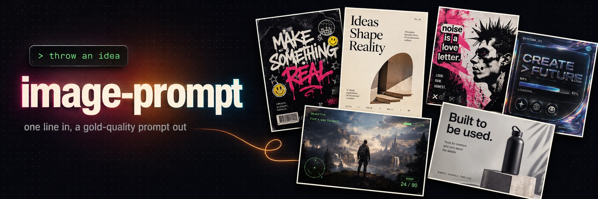

# Image Prompt Skills for Claude Code


A skill that turns a one-line idea into a gold-quality image-generation prompt. You supply the idea, the skill writes the whole prompt.

Throw something like "poster for a punk exhibition in Berlin" or "landing hero for a coffee delivery app". The skill detects the archetype, picks the aspect ratio, palette, and fonts, and returns one structured, copy-paste-ready prompt tuned for **gpt-image-2**. Press `c` to copy the prompt block, paste it into your image tool, done.

No prompt-engineering required.

## Installation

**Claude Code — plugin marketplace (recommended)**

```
/plugin marketplace add veryCoolTimo/imagegen-skills
/plugin install imagegen-skills@imagegen
```

**Claude Code — manual (clone + symlink)**

Clone the repo and symlink the skill into your personal skills directory:

```bash
git clone git@github.com:veryCoolTimo/imagegen-skills.git
cd imagegen-skills
ln -s "$(pwd)/skills/image-prompt" ~/.claude/skills/image-prompt
```

Restart Claude Code so it discovers the skill.

**claude.ai (web) and Claude Desktop**

Import the repository from the Skills panel, or point the plugin marketplace at this repo. The skill is a plain `SKILL.md` folder, so any surface that loads Claude skills can use it.

No API keys and no extra dependencies. The skill produces text only.

## Usage

Just describe what you want, in any language:

> сделай крутой промт для постера панк-выставки в Берлине, лимитированный тираж

> landing hero for a specialty coffee delivery app, warm and minimal

> game screenshot of a viking longship raid at dawn, AAA fidelity

> логотип для крафтовой пивоварни

> I want a poster — help me with the style

> put me on a movie one-sheet as an aquatic superhero (I'll attach my photo)

The skill replies with the finished prompt in a fenced code block plus one assumptions line (archetype, size, quality, brand, model). Redirect with a single sentence:

> make it 9:16

> darker palette, brand is NOVA

> another variant

## Skills

| Skill | What it does |
|---|---|
| **image-prompt** | Turns a short idea into one structured, production-grade image-generation prompt following proven layered-composition patterns. Optimized for gpt-image-2 by default. |

## What it builds

The skill recognizes nine archetypes and fills the right layout for each:

| Archetype | Example idea | Default size |
|---|---|---|
| Poster | punk exhibition, synthwave gig, manga cover | 1024x1536 |
| Landing hero | homeware store, snowboard eyewear | 1536x1024 |
| Product ad | milk brand, energy drink | 1024x1536 |
| UI mockup | farmers-market app, SaaS dashboard | 1024x1536 |
| Photoreal scene | candid portrait, real photograph | 1024x1536 |
| Game screenshot | action RPG boss fight with HUD | 1536x864 |
| Infographic | diagram, pitch slide, chart | 1024x1536 |
| Logo | bakery mark, brewery mark | 1024x1024 |
| Illustration | comic strip, character sheet, album cover | 1024x1536 |

## What the output looks like

A trimmed example for "synthwave gig poster":

```
Vertical gig-announcement poster for a fictional synthwave band "NOVA DECAY".
1980s outrun aesthetic - neon sunset grid, chrome type, VHS grain.

BACKGROUND / CANVAS:
Vertical 2:3. Night-sky gradient from hot magenta #FF2E88 at the horizon into
deep indigo #1A0B3B at the top, a neon wireframe grid receding to a vanishing point.

TYPOGRAPHY & TEXT:
- Wordmark: massive slanted italic chrome-bevel display (Bungee Inline style),
  cyan top highlight, magenta bottom reflection, reads "NOVA DECAY".
- Details: monospace cassette-label type, "SAT · 14 MARCH · DOORS 9PM".

PALETTE:
indigo #1A0B3B -> magenta #FF2E88, sunset orange #FF6B35, neon cyan #22E6FF, chrome #D4E4EC.

CONSTRAINTS:
Original design, no logos or trademarks, no watermark.
```

## How it works

Every prompt is assembled from a nine-block skeleton extracted from a corpus of high-quality reference prompts:

1. Concept line (format, medium, fictional brand, reference aesthetic, intended use)
2. Canvas and background (aspect ratio, treatment with hex, global texture)
3. Named composition zones (position, size percent, tilt, content) — the top quality signal
4. Subject detail (granular, IP-safe)
5. Typography and text (literal copy in quotes, real font references, hex colors)
6. Palette (four to six hex codes, each mapped to an element)
7. Font role map
8. Mood cluster
9. Finish and quality tag

The pipeline: `idea -> detect archetype -> expand to the nine blocks -> format for the model -> output`. Photoreal and game-screenshot ideas use a labeled-block variant (SCENE, SUBJECT, LIGHTING, CAMERA, HUD, TECHNICAL).

## Models

Default target is **gpt-image-2**. The core builder is model-agnostic — each model is one adapter file under `references/models/`, so the same idea renders correctly per target (each distilled from the model's official prompting guide):

| Model | Best for |
|---|---|
| **gpt-image-2** (default; + gpt-image-1/1.5) | all-round #1: quality, editing, text, photoreal |
| **Nano Banana Pro** (Gemini 3 Pro Image) | best legible text, up to 4K, factual infographics (Search grounding) |
| **Midjourney** V8.1/V7 | aesthetics, creative posters |
| **FLUX.2** | open/local, hex + typography + editing |
| **Recraft V4 Pro** | brand / typography / vector / logos, editable SVG |
| **Ideogram** v4 | in-image text specialist |
| **Reve 2.0** | prompt adherence + layout/element editing |
| **universal** | rich natural-language prompt for any/unknown tool |

Just name a model ("…for Midjourney", "in the anthropic style with nano banana pro") and the skill switches adapters.

## Optional: generate the image

By default the skill only writes the prompt. If you ask it to **generate** and a provider API
key is set, it can render the PNG for you via `scripts/generate.py` and save it into the
project. Supported providers (key in an env var, never committed):

`openai` · `openrouter` (universal — one key, many models) · `gemini` (Nano Banana Pro) ·
`ideogram` · `recraft` · `bfl` (FLUX.2) · `reve`. Midjourney has no API, so it stays prompt-only.

```bash
python3 scripts/generate.py --provider openrouter --prompt-file prompt.txt \
    --model google/gemini-3-pro-image --aspect 16:9 --resolution 2K --out out.png
```

Generation is opt-in and paid — the skill confirms before spending.

## Style presets

Found a look you love? Save it as a private preset and reuse it on any future idea.

> save this style as neon-noir

A preset captures the **style layer only** (background, palette, fonts, motifs, mood, finish) — content still comes from each new idea. Presets are stored per-user at `~/.claude/image-prompt/presets/<name>.md`, private to your machine and never committed. Reuse it:

> a poster for a coffee shop, in the neon-noir style

Manage them with "list my presets", "update <name>", "delete <name>".

**Share a preset with anyone** — no hosting, no accounts. Export it to a portable code:

> export preset neon-noir

You get an `imgpreset:v1:…` string. Whoever pastes it back gets the exact preset:

> import preset imgpreset:v1:H4sIAA…

The code is self-contained (gzip + base64 of the preset), so styles travel as plain text.

## Project structure

```
imagegen-skills/
├── README.md
├── assets/
│   └── banner.prompt.txt        # the prompt used to generate this banner
├── scripts/
│   └── generate.py              # optional: render a prompt via a provider API (opt-in)
└── skills/image-prompt/
    ├── SKILL.md                 # trigger, workflow, output format
    └── references/
        ├── anatomy.md           # the nine-block skeleton
        ├── archetypes.md        # templates and default size/quality per archetype
        ├── fonts-palettes.md    # font library by vibe and hex palette discipline
        ├── styles.md            # built-in style menu (repertoire to pick from)
        ├── edit-remix.md        # edit/remix workflow templates
        ├── generation.md        # optional: how the generate step calls provider APIs
        ├── gold-examples.md     # curated reference prompts, grows over time
        └── models/              # one adapter per model
            ├── gpt-image-2.md   # + gpt-image-1/1.5 family
            ├── gemini.md        # Nano Banana Pro (Gemini 3 Pro Image)
            ├── midjourney.md
            ├── flux.md
            ├── recraft.md
            ├── ideogram.md
            ├── reve.md
            └── universal.md
```

## Extending

- **New favourite prompt:** add it to `references/gold-examples.md` with a `Teaches:` tag.
- **New model:** add `references/models/<name>.md`. The workflow stays unchanged.

## Related projects

Sibling Claude Code skill bundles worth a look:

- [youtube-summary-skill](https://github.com/veryCoolTimo/youtube-summary-skill) — turn YouTube links into a searchable knowledge base
- [youtube-skills](https://github.com/sergebulaev/youtube-skills) — skills that help grow a YouTube channel
- [linkedin-skills](https://github.com/sergebulaev/linkedin-skills) — LinkedIn marketing skills

## License

MIT
